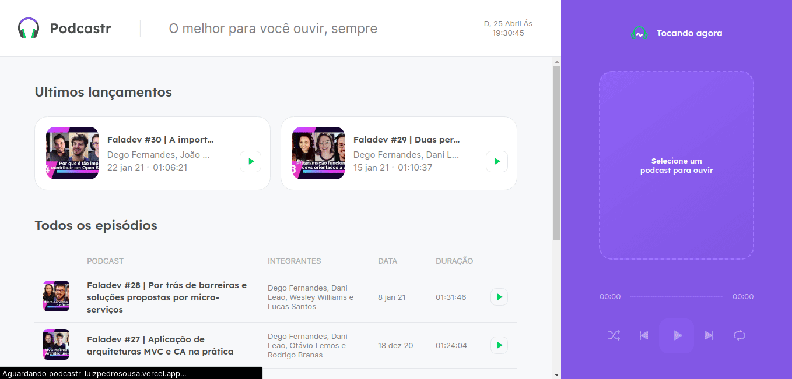
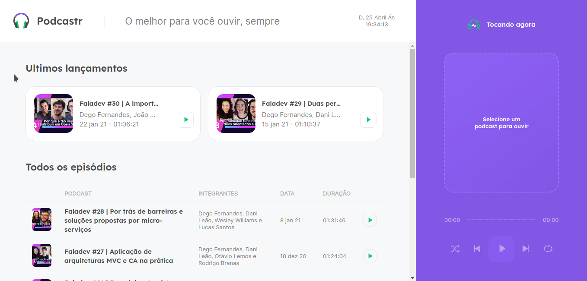

<h1 align="center">
  
  <br>
  <a href="https://github.com/LuizPedroSousa/Moveit/issues">
    
  </a>
  <a href="https://github.com/LuizPedroSousa/Moveit/stargazers">
    
  </a>
  <a href="https://github.com/LuizPedroSousa/Moveit/network">
    
  </a>
  <br/>
  <a href="https://github.com/LuizPedroSousa/Podcastr-Frontend/commits/master">
    
  </a>
  
</h1>

<p align="center">
  <a href="#page_facing_up-sobre">Sobre</a>&nbsp;&nbsp;&nbsp;|&nbsp;&nbsp;&nbsp;<a href="#eyes-demo">Demo</a>&nbsp;&nbsp;&nbsp;|&nbsp;&nbsp;&nbsp;<a href="#closed_book-instalação">Instalação</a>&nbsp;&nbsp;&nbsp;|&nbsp;&nbsp;&nbsp;<a href="#-tecnologias">Tecnologias</a>&nbsp;&nbsp;&nbsp;|&nbsp;&nbsp;&nbsp;<a href="#clipboard-road-map">Road map</a>&nbsp;&nbsp;&nbsp;|&nbsp;&nbsp;&nbsp;<a href="#man-author">Author</a>
</p>


<p align="center">
  
  &nbsp;
  
</p>
<br/>

## :page_facing_up: Sobre

Podcastr é uma plataforma para escutar podcasts especificos da Rocketseat.
<br/>

## :eyes: Demo

- Você pode testar em :point_right: https://podcastr-luizpedrosousa.vercel.app/

## :closed_book: Instalação

### Pré-Requisitos

#### Para rodar este projeto você vai precisar das seguintes ferramentas:

- <a href="https://git-scm.com/downloads">
    Git 
  </a>
- <a href="https://nodejs.org/pt-br/">
    Node 
  </a>
- <a href="https://www.npmjs.com/">Npm </a>
- ou <a href="https://yarnpkg.com/getting-started/install">Yarn </a>
- E um bom editor de código como o
  <a href="https://code.visualstudio.com/">
  VsCode 
  </a>

### Rodando

```bash

# Clone este repositório
$ git clone https://github.com/LuizPedroSousa/Podcastr-Frontend.git

# Entre na pasta
$ cd ./Podcastr-Frontend

# Instale as dependências
$ npm install

# Inicie o json-server
$ npm run server

# Abra outro terminal e inicie o projeto!
$ npm run dev

```

<br/>

## 🛠 Tecnologias

- <a href="https://nextjs.org/">
  Next-Js 
  </a>

- <a href="https://reactjs.org/">
  React-Js 
  </a>

- <a href="https://styled-components.com/">
  Sass 
  </a>


- <a href="https://www.typescriptlang.org/">
  TypeScript 
  </a>

<br/>

<br/>

## :man: Author

<a href="https://github.com/LuizPedroSousa">
  
  <br/>
</a>
<p>Feito com 💜 por <a href="https://github.com/LuizPedroSousa">Luiz Pedro</a> 😸 Entre em contanto!</p>

[](mailto:luizpedrosousa65@gmail.com)
